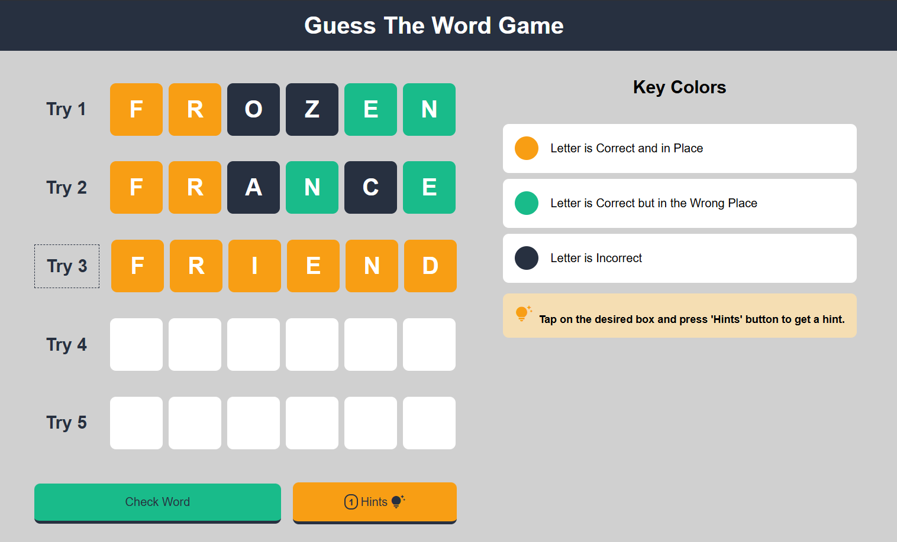

# Guess The Word Game

This is a solution to the [Guess The Word Game challenge](https://github.com/aymansoliman-dev/Guess-The-Word-Game).  
It’s a fun, interactive browser game where the player tries to guess the hidden word with the help of visual feedback for correct, misplaced, and incorrect letters.  

I also focused on **accessibility**, **SEO**, and added **Open Graph meta tags** for the first time, so the project looks good when shared on social media.  

---

## 📑 Table of contents

- [Overview](#overview)
  - [The challenge](#the-challenge)
  - [Design](#design)
  - [Links](#links)
- [My process](#my-process)
  - [Built with](#built-with)
  - [What I learned](#what-i-learned)
  - [Accessibility & SEO](#accessibility--seo)
  - [Continued development](#continued-development)
  - [Useful resources](#useful-resources)
- [Lighthouse Report](#lighthouse-report)
- [Author](#author)

---

## 📌 Overview

### 🎯 The challenge

Users should be able to:

- Guess the hidden word letter by letter  
- See different key colors for:  
  - ✅ Letter is correct and in the right position  
  - 🟡 Letter is correct but in the wrong position  
  - ❌ Letter is not in the word at all  
- Play the game using only their keyboard  
- View a responsive layout depending on device size  
- See hover and focus states for interactive elements  
- Use hints (limited) for better playability  

### 🎨 Design



### 🔗 Links

- Solution URL: [Challenge Solution](https://github.com/aymansoliman-dev/Guess-The-Word-Game)  
- Live Site URL: [Live Preview](https://aymansoliman-dev.github.io/Guess-The-Word-Game/)  

---

## 🚀 My process

### 🛠 Built with

- **HTML**  
- **CSS** (Flexbox, Responsive design – desktop-first)  
- **JavaScript**:  
  - DOM manipulation  
  - Event listeners  
  - Keyboard events  
  - Custom validation  
  - State management  

---

### 📚 What I learned

From building this project, I learned several JavaScript and DOM manipulation concepts:

- **Using constants for key codes** – readability in keyboard event handling.  
- **Audio handling** – creating `Audio` objects, controlling playback, and using sounds for feedback.  
- **Form-like keyboard navigation** – moving between input fields with arrow keys, backspace, and Enter.  
- **State management** – tracking `numberOfTrials` and `numberOfHints` dynamically.  
- **Dynamic DOM updates** – adding/removing classes for `.correct`, `.incorrect`, `.not-in-place`.  
- **Creating dynamic popups** – generating success/failure messages in the DOM.  
- **Game logic functions** – reusable functions like `checkLetters()`, `generateFailingMsg()`, `generateSuccessMsg()`.  
- **User input validation** – preventing empty/invalid guesses.  
- **Accessibility** – ensuring the game is accessible for users with disabilities.  
- **SEO** – optimizing the page for search engines.  
- **Open Graph meta tags** – sharing the game on social media.

---

```js
function checkLetters(guess, WORD, activeRow) {
    for (let i = 0; i < guess.length; i++) {
        if (guess[i] === WORD[i]) {
            activeRow.querySelector(`.letter-${i+1}`).classList.add('correct');
            activeRow.querySelector(`.letter-${i+1}`).setAttribute('checked', '');
        }
        else if (WORD.includes(guess[i]) && guess[i] !== '') {
            activeRow.querySelector(`.letter-${i+1}`).classList.add('not-in-place');
            activeRow.querySelector(`.letter-${i+1}`).setAttribute('checked', '');
        }
        else {
            activeRow.querySelector(`.letter-${i+1}`).classList.add('incorrect');
            activeRow.querySelector(`.letter-${i+1}`).setAttribute('checked', '');
        }
    }
}
```
```js
// Form-like keyboard navigation
Array.from(inputFields).forEach(inputField => {
    inputField.addEventListener('input', () => {
        inputField.setAttribute('value', inputField.value.toUpperCase());
        if (inputField.nextElementSibling !== null) inputField.nextElementSibling.focus();
    });
});

// Keyboard navigation
Array.from(inputFields).forEach(inputField => {
    inputField.addEventListener('keydown', (e) => {
        if (e.keyCode === VK_LEFT) inputField.previousElementSibling.focus();
        else if (e.keyCode === VK_RIGHT) inputField.nextElementSibling.focus();
        else if (e.keyCode === VK_BACKSPACE) {
            const currentInputValue = inputField.value;
            if (currentInputValue === '' && !inputField.previousElementSibling.disabled) {
                inputField.previousElementSibling.focus();
                inputField.previousElementSibling.value = "";
                inputField.previousElementSibling.setAttribute('value', '');
            } else {
                inputField.setAttribute('value', '');
                inputField.value = "";
            }
        }
        else if (e.keyCode === VK_ENTER) document.getElementById('check-button').click();
    })
});
```

```html
<meta charset="UTF-8">
<meta name="viewport" content="width=device-width, initial-scale=1.0">
<meta http-equiv="X-UA-Compatible" content="ie=edge">
<meta name="Author" content="Ayman Soliman">
<meta name="Description" content="Guess the word game">
<meta name="Keywords" content="game, word, guess, game, word, guess">
<meta name="Language" content="English">

<!-- Open Graph -->
<meta property="og:title" content="Guess the Word Game">
<meta property="og:description" content="A fun game to guess the word based on given clues.">
<meta property="og:image" content="https://res.cloudinary.com/dxlofja7z/image/upload/v1755326128/desktop_he7l1d.png">
<meta property="og:url" content="https://aymansoliman-dev.github.io/Guess-The-Word-Game/">
<meta property="og:type" content="website">
<meta property="og:site_name" content="Guess the Word Game">
<!-- Twitter -->
<meta name="twitter:card" content="summary_large_image">
<meta name="twitter:title" content="Guess the Word Game">
<meta name="twitter:description" content="A fun game to guess the word based on given clues.">
<meta name="twitter:image" content="https://res.cloudinary.com/dxlofja7z/image/upload/v1755326128/desktop_he7l1d.png">
<meta name="twitter:creator" content="@a_soliman1783">
```

### Accessibility, SEO, and Best Practices

- Added ARIA roles and focus states for keyboard navigation.

- Ensured good color contrast and proper labels.

- First project where I used Open Graph meta tags (Facebook, Twitter, LinkedIn previews).

- Scored 100 in Accessibility, SEO, and Best Practices on Lighthouse.

#### Lighthouse Report

- ⚡ Performance: 90  
- ♿ Accessibility: 100
- ✅ Best Practices: 100
- 🔍 SEO: 100

##

### Useful resources

- MDN Web Docs - Always helpful for checking JavaScript and CSS syntax.

- JavaScript.info - Great explanations for DOM manipulation and events.


## Author

- Website - [Ayman Soliman](https://bento.me/ayman-soliman)
- Frontend Mentor - [aymansoliman-dev](https://www.frontendmentor.io/profile/aymansoliman-dev)
- Twitter - [@a_soliman1783](https://x.com/a_soliman1783)